<p align="center">
  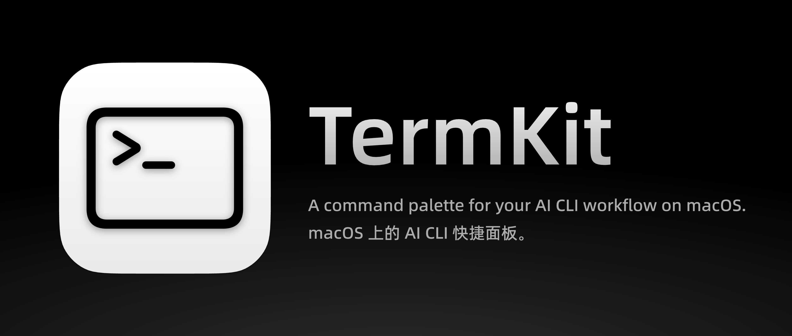
</p>

<p align="center">
  <b>A command palette for your AI CLI workflow on macOS.</b><br/>
  Hold ⌘ → Menu appears → Select → Release ⌘ → Command pasted to terminal<br/>
  🌍 Supports 9 languages · 支持 9 种语言
</p>

<p align="center">
  <a href="#installation">Installation</a> •
  <a href="#features">Features</a> •
  <a href="#keyboard-shortcuts">Shortcuts</a> •
  <a href="#settings">Settings</a> •
  <a href="LICENSE">License</a>
</p>

<p align="center">
  English | <a href="README.md">中文</a>
</p>

---

## Why TermKit?

Switching from VS Code extensions to CLI isn't easy. Opening files means typing paths manually, pasting images requires saving to disk first, and deleting text has no cursor selection — many one-click GUI operations become manual work in the terminal.

But CLI has its strengths: dedicated windows, no mixing with browsers or IDEs, and no tab-hunting when running multiple projects.

**TermKit makes the terminal better — compress repetitive operations into a single keypress.**

---

## Installation

### Download DMG

Download the installer and drag to Applications:

[Baidu Netdisk](https://pan.baidu.com/s/1WT3Q1UcDlOWI1VpmJefdfw?pwd=1jtv) (Code: 1jtv)

### Build from Source

```bash
git clone https://github.com/MenheraHann/TermKit.git
cd TermKit
make install
```

Builds, code-signs (ad-hoc), and installs to `/Applications`. The app launches automatically.

```bash
# Uninstall
make uninstall
```

**Requirements:**
- macOS 13.0 (Ventura) or later
- Xcode Command Line Tools (Swift 5.9+)
- Accessibility + Input Monitoring permissions

---

## Features

### Hierarchical Menu & CLI Launcher

The root menu lists your folders, CLI tools, and command templates. Navigate through layers to build a complete command:

```
cd '/Users/you/Projects/MyApp' && claude --resume
```
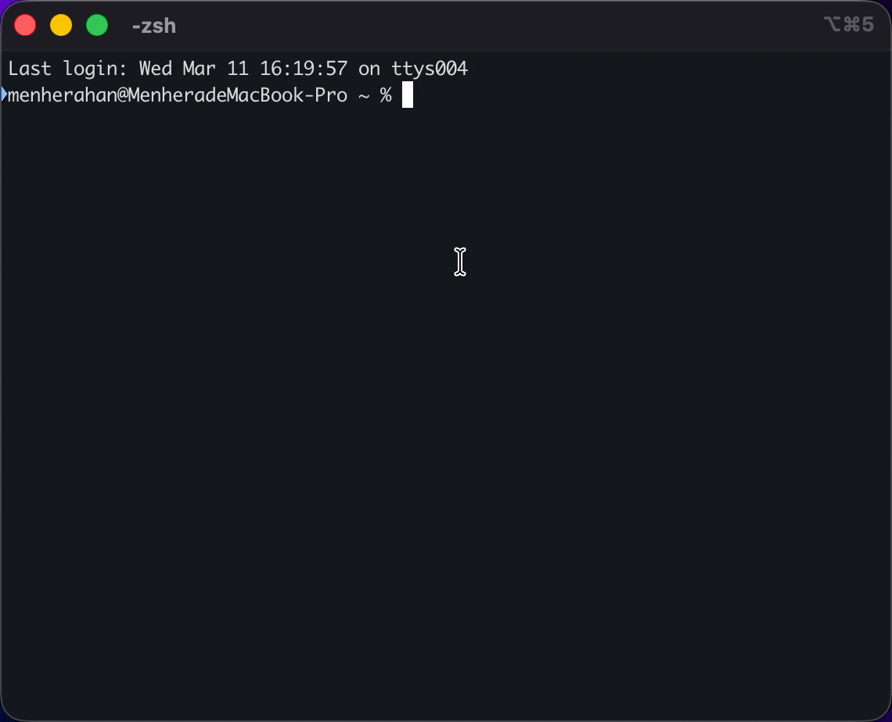

Ships with presets for Claude Code, Gemini CLI, OpenAI Codex, OpenCode, OpenClaw, and GitHub Copilot CLI. Every CLI's common actions are pre-configured, and fully customizable.

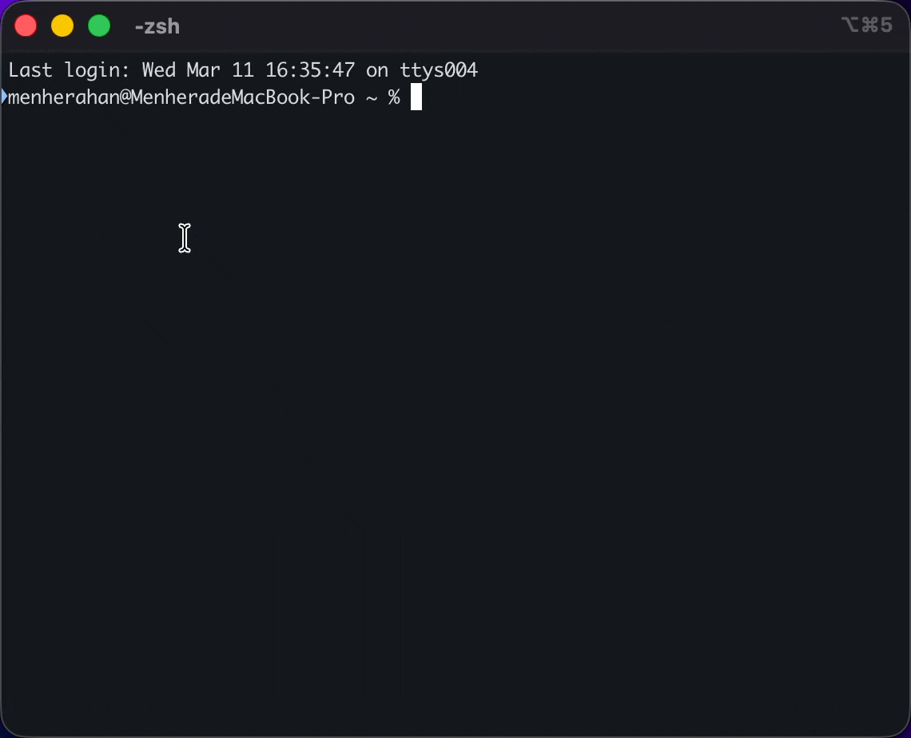

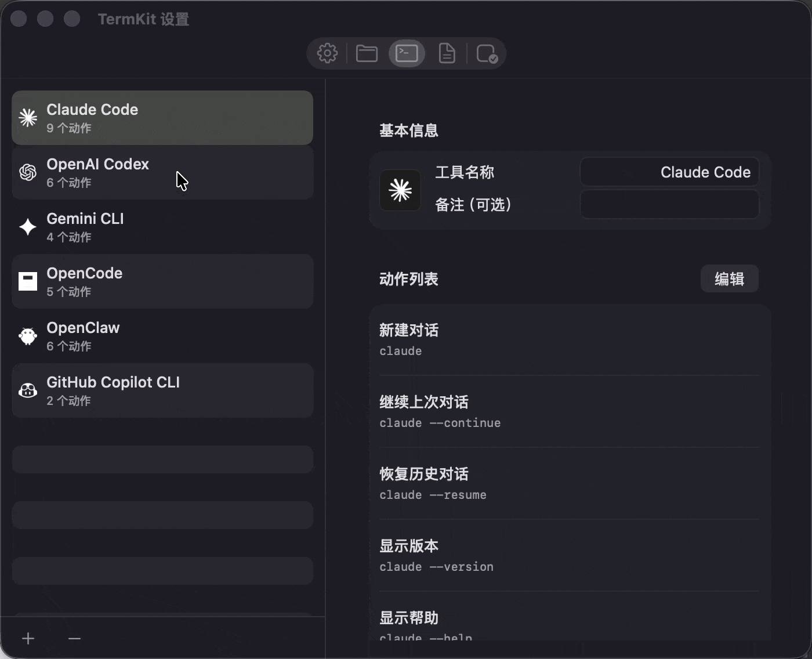

### Folder Shortcuts

Add frequently used project directories for quick `cd` access.

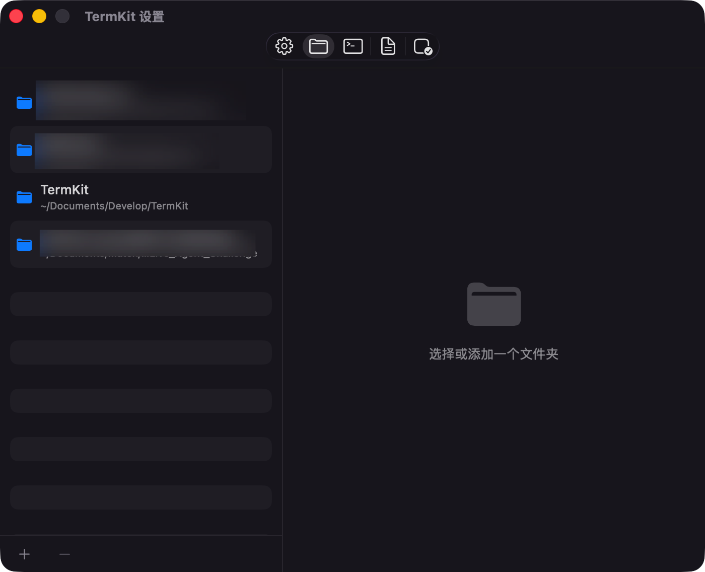

### Slash Commands

Built-in interactive commands (`/clear`, `/exit`, `/compact`, etc.) — select from the menu to paste directly.

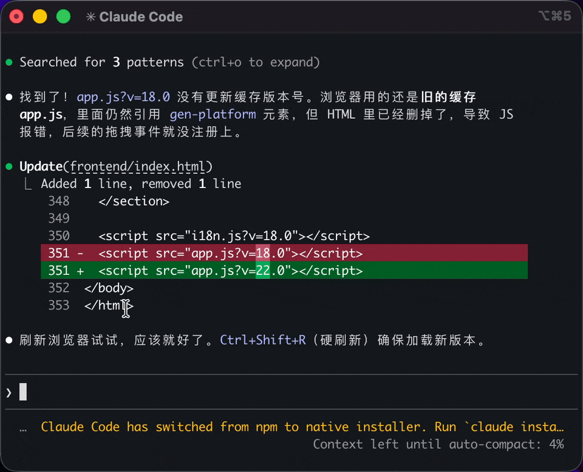

### Smart Paste

Text in clipboard → paste directly. Image in clipboard → auto-save to local directory and paste the file path. Perfect for feeding screenshots to AI.

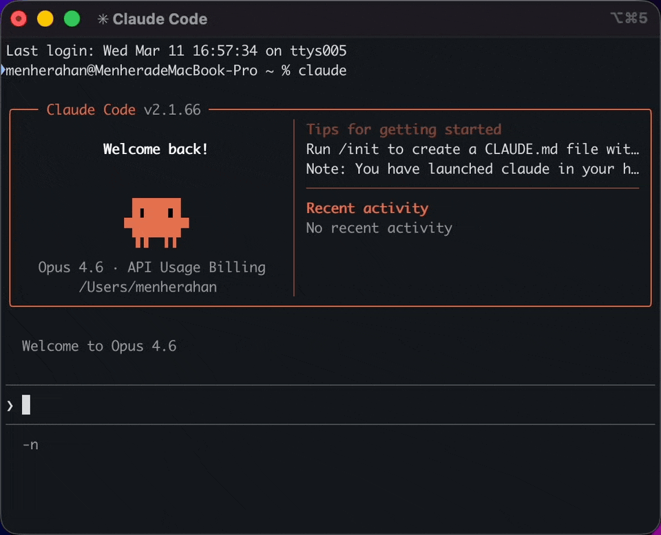

### Open Selected Path

Select a file path in the terminal → press `L` in the menu → opens in Finder or default app. Supports quoted paths, `~/` expansion, and `file:line:col` format.

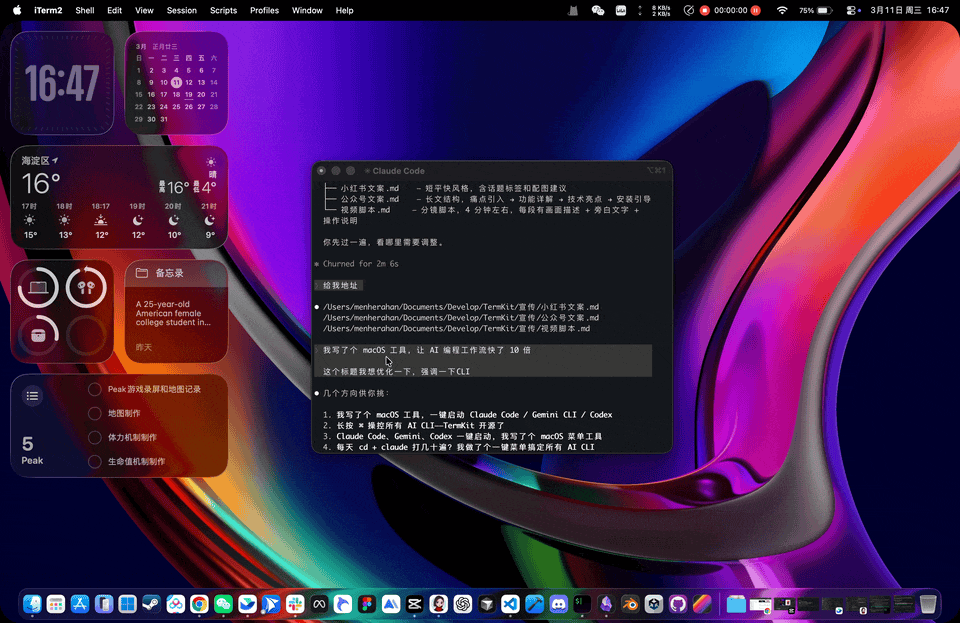

### Clear Line Input

Press `Delete` in the menu to clear the current input line. Press repeatedly to clear multiple lines.

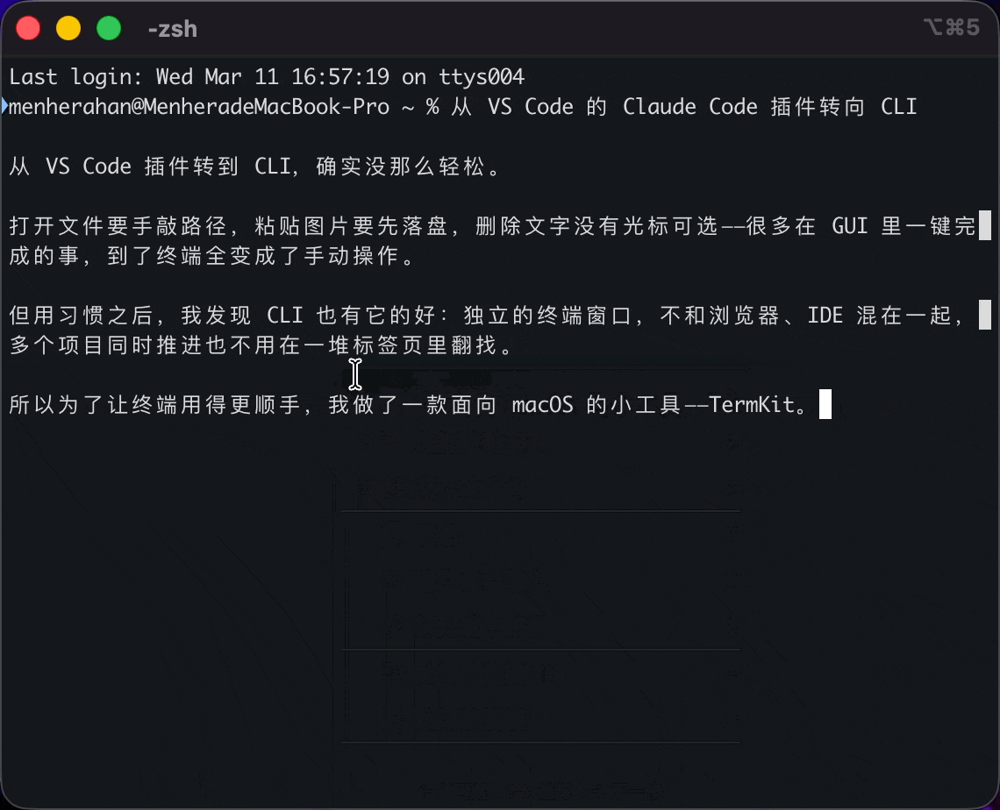

### Clipboard Protection

After every paste operation, TermKit automatically restores your original clipboard contents (text, images, and more).

### App Whitelist

Only triggers when specified apps (terminals, editors) are in the foreground. Other apps are completely unaffected.

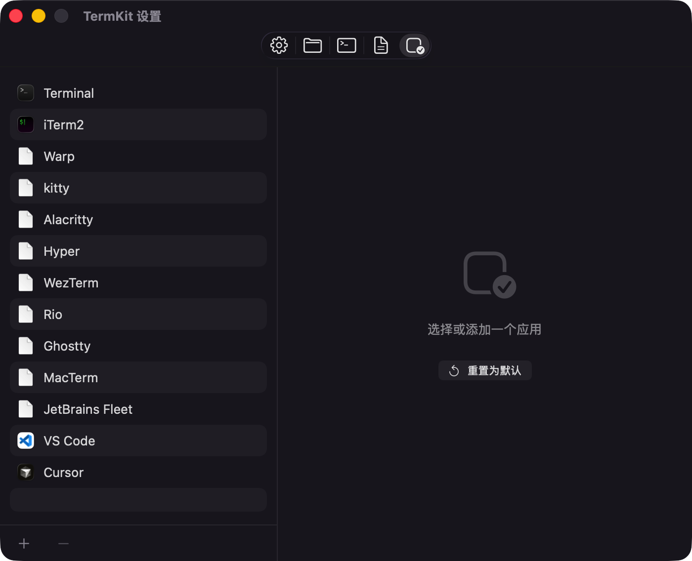

---

## Keyboard Shortcuts

| Key | Action |
|-----|--------|
| `1-9` / `0` | Select menu item |
| `↑` `↓` | Move up / down |
| `←` `→` | Go back / enter next level |
| `` ` `` `~` | Go back one level |
| `V` | Smart paste |
| `L` | Open selected path |
| `⌫` | Clear line input |
| `-` | Disable shortcut for 1 hour |
| `=` | Disable shortcut permanently |
| `Esc` | Cancel |
| Release ⌘ | Confirm & execute |

---

## Settings

Click the menu bar icon → Settings:

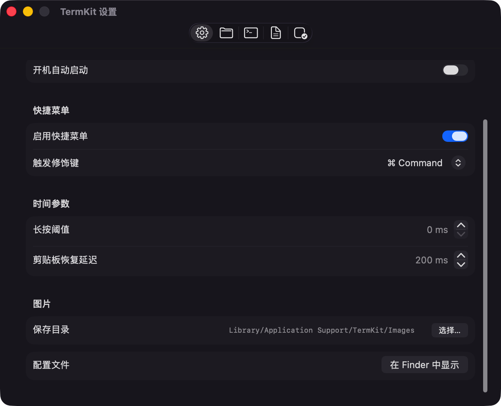

| Tab | Description |
|-----|-------------|
| **General** | Trigger key, hold threshold, language |
| **Folders** | Add project directories for quick `cd` |
| **CLI Tools** | Configure CLI tools and actions |
| **Templates** | Command templates with `{variable}` placeholders |
| **Apps** | App whitelist management |

---

## Tech Stack

| | |
|---|---|
| Language | Swift, SwiftUI |
| Key Detection | CGEventTap (defaultTap) |
| Min OS | macOS 13 (Ventura) |
| Languages | 9 (简中/繁中/EN/日/韩/西/法/德/葡) |

---

## Building

```bash
make build     # Build only
make app       # Build + package .app
make install   # Build + install to /Applications
make clean     # Clean build artifacts
```

---

## License

[MIT](LICENSE) © 2026 MenheraHann

## Trademark Notice

TermKit includes icon assets for third-party CLI tools (Claude/Anthropic, Gemini/Google, GitHub Copilot/Microsoft, OpenAI, OpenClaw, OpenCode) for identification purposes only. All trademarks and brand assets belong to their respective owners. TermKit is not affiliated with or endorsed by any of these companies.
